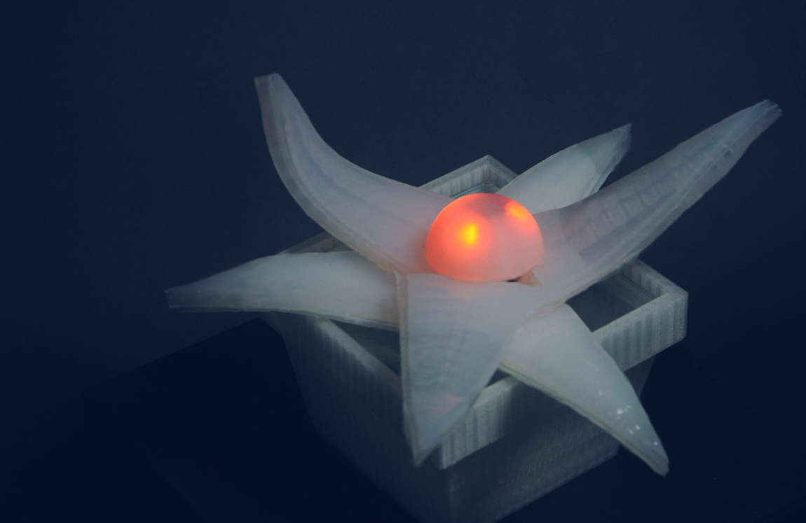
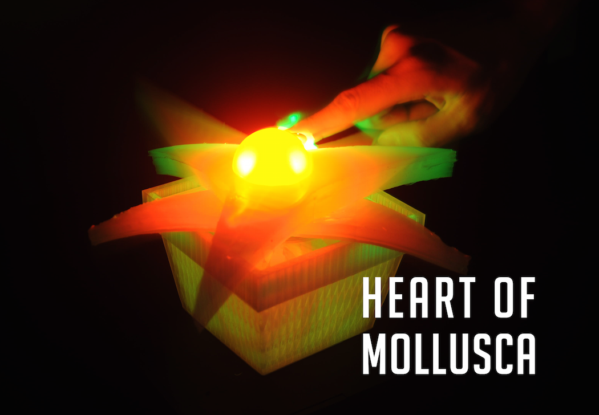

# Heart of Mollusca

+ [Heart of Mollusca 紹介動画](https://vimeo.com/240353748)
+ [ADAA アジアデジタルアートアワード 学生インタラクティブアート部門 優秀賞](https://adaa.jp/ja/winners/winners2017.html)

## レシピ

1. シリコン
	+ Ecoflex [サツク株式会社](https://vimeo.com/240353748)
	+ DragonSkin [サツク株式会社](https://vimeo.com/240353748)
	+ SilPoxy [サツク株式会社](https://vimeo.com/240353748)
2. 電気系統
	+ Arduino UNO [スイッチサイエンス](https://www.switch-science.com/catalog/789/)
	+ ソレノイド電磁石バルブ [amazon](https://www.amazon.co.jp/uxcell-a14010700ux0271-uxcell-%E3%82%BD%E3%83%AC%E3%83%8E%E3%82%A4%E3%83%89%E9%9B%BB%E7%A3%81%E7%9F%B3%E5%BC%81-%E3%82%BD%E3%83%AC%E3%83%8E%E3%82%A4%E3%83%89%E9%9B%BB%E7%A3%81%E7%9F%B3%E3%83%90%E3%83%AB%E3%83%96-%E7%A9%BA%E6%B0%97%E3%82%AC%E3%82%B9%E3%82%BD%E3%83%AC%E3%83%8E%E3%82%A4%E3%83%89%E3%83%90%E3%83%AB%E3%83%96-DC%E3%83%9E%E3%82%B0%E3%83%8D%E3%83%83%E3%83%88-%E3%82%AA%E3%83%BC%E3%83%97%E3%83%B3%E3%83%95%E3%83%AC%E3%83%BC%E3%83%A0-0-4-0-5kgf-cm2-2-6V/dp/B00JR3ZQSC/ref=pd_sbs_328_19?_encoding=UTF8&psc=1&refRID=D9Q86W53MPAES85V7PW6)
	+ 気圧センサー MIS-2500-015G [秋月](http://akizukidenshi.com/catalog/g/gP-07272/)
	+ 心拍センサー [スイッチサイエンス](https://www.switch-science.com/catalog/1135/)
	+ Mitsumi マイクロエアポンプ [amazon](https://www.amazon.co.jp/Mitsumi-R-14-%E3%83%9E%E3%82%A4%E3%82%AF%E3%83%AD%E3%82%A8%E3%82%A2%E3%83%9D%E3%83%B3%E3%83%97-200mA-%E3%83%9F%E3%83%8B%E3%83%9D%E3%83%B3%E3%83%97/dp/B01H6VHRDS/ref=sr_1_1?ie=UTF8&qid=1492408470&sr=8-1&keywords=mitsumi)
	+ 2Aデュアルモーターコントローラー [秋月](http://akizukidenshi.com/catalog/g/gM-06680/)
3. 小物系
	+ シリコンチューブ 4mm x 6mm [モノタロウ](https://www.monotaro.com/g/00250063/)
	+ シリコンチューブコネクター (二方型・クロス型・T型) [モノタロウ](https://www.monotaro.com/p/8933/4497/)
	+ PP ディスクカップ [モノタロウ](https://www.monotaro.com/p/5843/8712/?t.q=%83%7E%83L%83V%83%93%83O%83J%83b%83v)
	+ 極薄ニトリルゴム手袋 [モノタロウ](https://www.monotaro.com/g/00277898/?t.q=%8E%E8%91%DC)
	+ アルミ丸パイプ [モノタロウ](https://www.monotaro.com/g/00280306/)
	+ テルモシリンジ [モノタロウ](https://www.monotaro.com/p/0292/1861/?t.q=%83V%83%8A%83%93%83W)
	+ 割り箸
	+ 計量器
	
4. 設備
	+ 真空チャンバー
	+ オーブン
	+ 3Dプリンター
	
## Arduino配線図

## 3Dデータ素材

* 球体上部分
* 球体下部分
* Ecoflex用フタ部分
* Ecoflex用土台
* DragonSkin用土台

## Eagle切削基板

